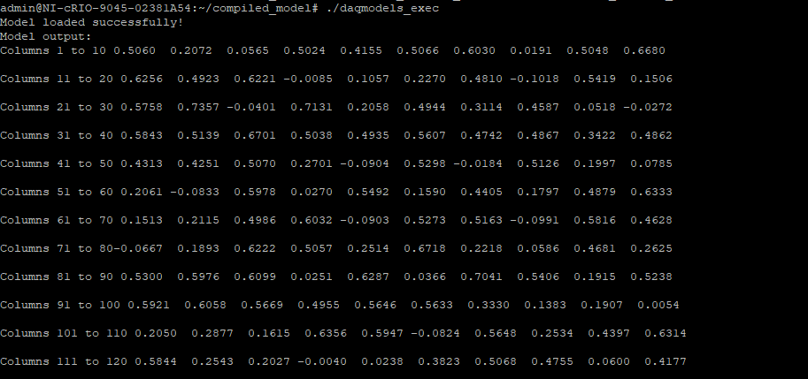
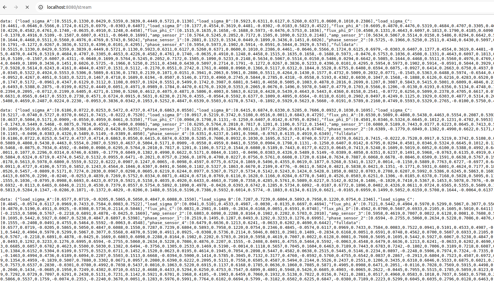
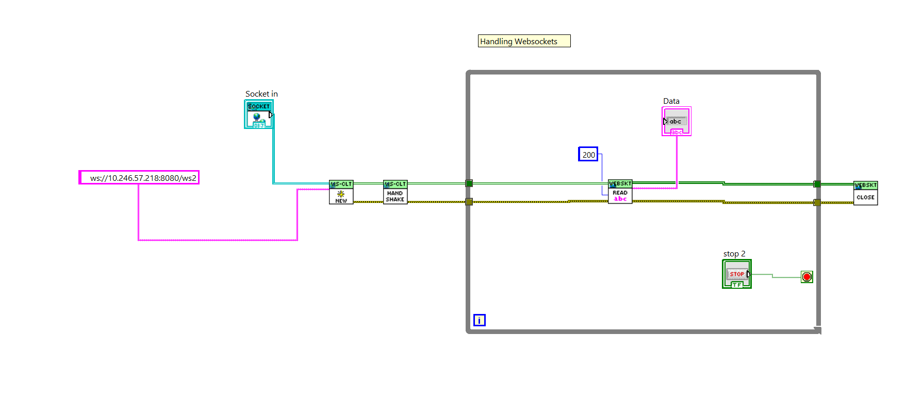

<h1 align="center" style="font-size: 24px; font-weight: bold;">
  Torque Sensor AI Model Inference
</h1>

<p align="center">
  C++ inference server for AI-powered torque sensor prediction on NI DAQ devices.
</p>

<p align="center">
  
  
  
  
</p>

---

## Model Demo on NI DAQ Device

<p align="center">
  
</p>

---

## Overview

This project provides a lightweight HTTP + WebSocket inference server written in C++ that loads a TorchScript model (`.pt`) trained over torque dataset (under dev) and serves predictions. It is designed to run directly on NI DAQ embedded devices, enabling real-time AI inference without any Python runtime.

---

## 🔧 Setup and Running

### 0. Clone the repo

```sh
git clone git@github.com:Helmut-Schmidt-University-EMA/ai-torque-cpp-inference.git
```

### 1. Download LibTorch

1. Download the appropriate version of **LibTorch** (C++ distribution of PyTorch) from the [official website](https://pytorch.org/get-started/locally/) based on your OS (Linux shown here; Windows also supported) and extract it.
2. Create a `libs` folder and place LibTorch inside it so the path is `libs/libtorch/...`

> **Note:** Make sure to select the **CPU** target — GPU is not required or supported at this stage.

### 2. Build the Project

#### Linux / macOS

```bash
cd ai-torque-cpp-inference
mkdir -p build
cd build
cmake ..
make
```

#### Windows

```bash
mkdir build
cd build
cmake -G Ninja ..
ninja
```

> **Tip:** The `scripts/` folder contains shell scripts to make building easier. Copy `scripts/build.sh` to the project root and run it — it will automatically remove the old build, rebuild, and launch the server.
>
> ```bash
> cp scripts/build.sh .
> chmod +x build.sh
> ./build.sh
> ```

### 3. Copy the model to the build folder

Download the trained model from the web platform and place it in the `build/` folder as `model.pt`.

> A demo model (`model.pt`) is included in the repo root for testing purposes. **This is a placeholder model only** — replace it with the production model once training is complete.

### 4. Run the server

```sh
./daqmodels_exec
```

Optional arguments:

```sh
./daqmodels_exec [model_path] [port] [input_dimension]
# Default: model.pt  8080  135
```

---

## 🚀 How to Deploy on DAQ Device

1. Build on Linux
2. Create a `compiled_model/` folder on the DAQ device containing:
   - `model.pt`
   - `daqmodels_exec`
   - `torchlibs/` (copy of `.so` files from `libtorch/lib/`)
3. On the DAQ device, run:

```sh
cd compiled_model
export LD_LIBRARY_PATH=./torchlibs/:$LD_LIBRARY_PATH
./daqmodels_exec
```

---

## 📡 API Endpoints
> ⚠️ **These endpoint are still being tested.** 
Once the server is running, the following endpoints are available:

| Method | Path | Description |
|--------|------|-------------|
| `GET` | `/` | Server info and endpoint listing |
| `POST` | `/predict` | Run a single inference (HTTP) |
| `GET` | `/stream` | HTTP SSE demo stream (browser) |
| `WS` | `/ws` | WebSocket inference (send data, get predictions) |
| `WS` | `/ws2` | WebSocket auto-stream demo (LabVIEW) |

### POST `/predict`

Send a JSON body with a `data` array of floats matching the model's input dimension (default: 135):

```json
{ "data": [0.1, 0.2, 0.3, ..., 0.135] }
```

The response is a flat JSON object with predicted sensor fields:

```json
{
  "load_sigma_A": [...],
  "load_sigma_B": [...],
  "flux_phi_A":   [...],
  "amp_sensor_1": [...],
  "phase_sensor_1": [...],
  "fulldata": [...]
}
```

### GET `/stream` — Browser SSE Demo

This endpoint streams 10 inference results as [Server-Sent Events (SSE)](https://developer.mozilla.org/en-US/docs/Web/API/Server-sent_events) using randomly generated input data. It is intended as a **browser-based demo** to visually verify the server is running and producing output correctly.

Open it directly in your browser:

```
http://localhost:8080/stream
```

<p align="center">
  
</p>

### WS `/ws2` — LabVIEW WebSocket Demo


`/ws2` is a WebSocket auto-stream demo designed for use with **LabVIEW**. Once connected, it continuously pushes inference results at 500 ms intervals using random input data (20 iterations), making it easy to test LabVIEW integration without needing to send data manually.

A LabVIEW VI demonstrating the WebSocket connection flow is available on the Windows PC (main file). The VI shows how to initiate the upgrade handshake and receive streamed JSON results.

<p align="center">
  
</p>

### WS `/ws` — WebSocket Inference

`/ws` is the primary WebSocket endpoint for real-time inference. Send a JSON message in the same format as `/predict` and receive predictions immediately:

```json
// Send
{ "data": [0.1, 0.2, ..., 0.135] }

// Receive
{ "load_sigma_A": [...], ..., "fulldata": [...] }
```

---

## 📁 Project Structure

```
ai-torque-cpp-inference/
├── src/                  # Main API implementation (HTTP + WebSocket server)
├── include/              # Header files
├── scripts/              # Shell scripts for building and running
│   └── build.sh          # Auto-clean, rebuild, and run script
├── archive/              # Old demo and connection test files (kept for reference)
├── assets/               # Screenshots and documentation images
├── CMakeLists.txt        # CMake build configuration
├── model.pt              # Demo TorchScript model for testing (replace with production model)
└── README.md
```

> **`archive/`** — Contains earlier demo files used during initial connection testing. The main server implementation lives in `src/`.
>
> **`model.pt`** — A demo trained AI model included for testing. Once the production model is ready from the training platform, replace this file with the real one.
>
> **`scripts/`** — Contains `build.sh` which simplifies the build workflow. Copy it to the project root to use it.

---

## Dependencies

- [LibTorch](https://pytorch.org/get-started/locally/) — C++ PyTorch runtime
- [OpenSSL](https://www.openssl.org/) — SHA-1 for WebSocket handshake
- C++17 compatible compiler (GCC, Clang, MSVC)
- CMake 3.14+
